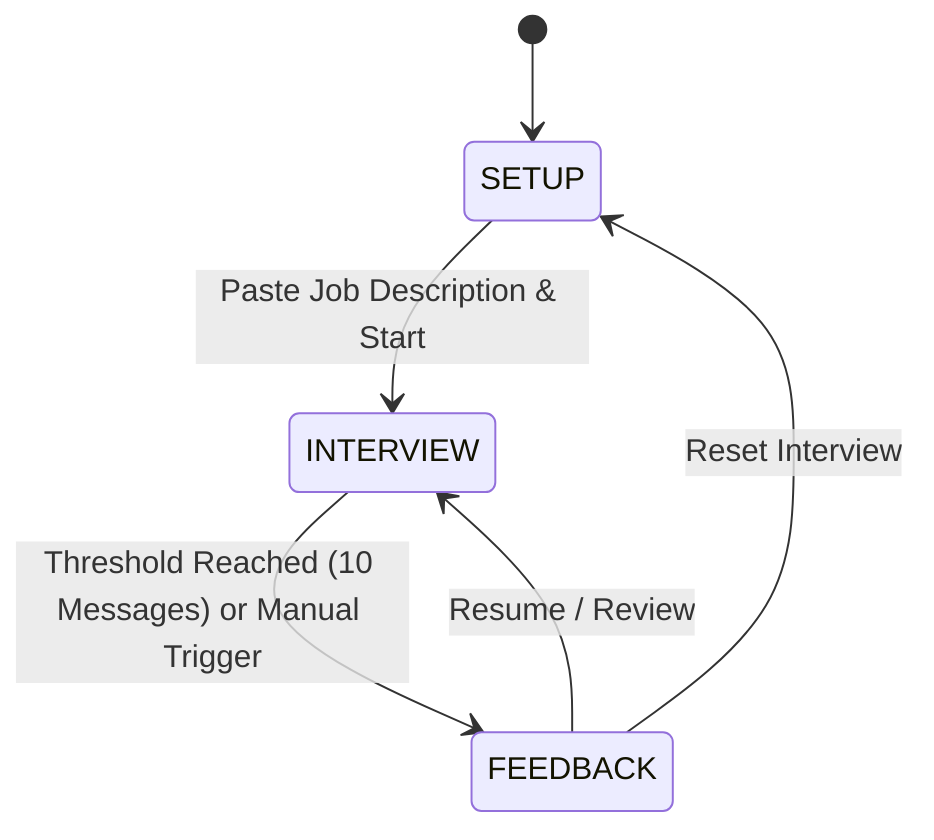

# AI Interview Simulator

An intelligent, interactive mock interview platform built with **Next.js App Router**, **TypeScript**, **Tailwind CSS**, and the **Vercel AI SDK**. 

The simulator puts candidates through a realistic technical or behavioral screening conducted by an AI Hiring Manager tailored specifically to any provided Job Description.

---

## 🎯 Overview

Preparing for technical and domain-specific job interviews requires realistic, responsive practice. **AI Interview Simulator** bridges the gap between passive study and live interviews:

1. **Role-Tailored Context**: Candidates paste a target Job Description. The AI extracts key requirements, tech stack constraints, and seniority expectations.
2. **Realistic Hiring Manager Flow**: The AI adheres to strict interviewing etiquette—introducing itself, asking only one targeted question at a time, silently assessing answers, and conducting deep-dive follow-ups.
3. **Instant Evaluation Dashboard**: At the end of the interview loop, candidates receive an objective, structured performance scorecard detailing strengths, growth opportunities, and a final hiring decision.

---

## ⚡ Tech Stack

| Layer | Technology | Purpose |
|---|---|---|
| **Framework** | [Next.js](https://nextjs.org/) 16 (App Router) | React framework with server-side streaming & API routes |
| **Language** | [TypeScript](https://www.typescriptlang.org/) 5 | Static type safety and strict schema validation |
| **AI Integration** | [Vercel AI SDK](https://sdk.vercel.ai/) (`ai`, `@ai-sdk/openai`) | Stream-based LLM orchestration (`streamText` & `useChat`) |
| **Styling** | [Tailwind CSS](https://tailwindcss.com/) & CSS Variables | Responsive dark-slate UI, custom scrollbars, and fluid layout |
| **Icons** | [Lucide React](https://lucide.dev/) | Clean UI iconography |
| **Utilities** | `clsx` + `tailwind-merge` | Conflict-free conditional CSS class management |

---

## 🏗️ Architecture & State Lifecycle

The application operates as a finite state machine with three core views:



### 1. `SETUP` State
- Captures candidate's target Job Description via a large, auto-resizing text area.
- Includes client-side length validation (enforcing minimum character limits for realistic context).
- Provides one-click sample role templates (*Senior Full Stack Engineer*, *Product Manager*) for rapid local testing.

### 2. `INTERVIEW` State
- Live chat view powered by Vercel AI SDK's `useChat`.
- Dispatches payload `{ messages, jobDescription }` to `/api/chat`.
- Distinct message styling for the **Hiring Manager** and **Candidate**.
- Real-time stream status tracking (`Typing question...` / `Evaluating response...`).
- Auto-scroll lock to maintain view on the latest incoming prompt.

### 3. `FEEDBACK` State
- Quantitative session overview: Questions answered, total message exchanges, and completion status.
- Rendered assessment scorecard containing:
  - **Candidate Strengths**
  - **Areas for Improvement**
  - **Final Hiring Recommendation**
- Clipboard export utility and one-click session reset.

---

## 📂 Project Structure

```text
ai-interview-simulator/
├── public/                 # Static branding assets & SVG icons
├── src/
│   ├── app/
│   │   ├── api/
│   │   │   └── chat/
│   │   │       └── route.ts # Edge/Node POST endpoint with streamText & simulated fallback
│   │   ├── globals.css      # Dark-slate theme & CSS custom properties
│   │   ├── layout.tsx       # Root layout, persistent navbar & footer
│   │   └── page.tsx         # Tri-state client view (Setup, Interview, Feedback)
│   ├── components/
│   │   └── MarkdownScorecard.tsx # Dedicated custom Markdown renderer for scorecard
│   ├── data/
│   │   └── sample-jobs.ts   # Multi-discipline job templates (Frontend, Backend, AI PM)
│   ├── lib/
│   │   └── utils.ts         # Class name composition utility (cn)
│   └── types/
│       └── interview.ts     # Centralized TypeScript models & interfaces
├── .env.example             # Environment variable template
├── next.config.ts           # Next.js configuration
├── package.json             # Scripts & dependencies
├── postcss.config.mjs       # PostCSS Tailwind integration
└── tsconfig.json            # TypeScript configuration
```

---

## 🚀 Getting Started

### Prerequisites
- **Node.js**: v18.18.0 or later (Node.js 20+ recommended)
- **Package Manager**: `npm`, `pnpm`, or `yarn`
- **OpenAI API Key**: Access to OpenAI API models (e.g. `gpt-4o-mini` or `gpt-4o`)

### 1. Clone the Repository
```bash
git clone https://github.com/Mark3172/AI-interview-simulator.git
cd AI-interview-simulator
```

### 2. Install Dependencies
```bash
npm install
```

### 3. Configure Environment Variables
Copy the example `.env` file:
```bash
cp .env.example .env.local
```

Populate your OpenAI API key in `.env.local`:
```env
# Required: OpenAI API Key
OPENAI_API_KEY=sk-your-openai-api-key-here

# Optional: Default LLM (defaults to gpt-4o-mini)
OPENAI_MODEL=gpt-4o-mini
```

### 4. Run the Development Server
```bash
npm run dev
```

Open [http://localhost:3000](http://localhost:3000) in your browser.

---

## 🛠️ Development Scripts

| Command | Description |
|---|---|
| `npm run dev` | Starts the Next.js development server with live reload on port 3000 |
| `npm run build` | Compiles an optimized production build with TypeScript checks |
| `npm start` | Boots the compiled production server |
| `npm run lint` | Runs ESLint checks across the codebase |

---

## 🧠 System Prompt & Evaluation Logic

The AI Hiring Manager runs with an injected system instruction on every session:

```text
You are a strict but fair Hiring Manager. You are interviewing the user for a role based on this Job Description: {jobDescription}. 
RULES: 
1. Introduce yourself briefly and ask the first interview question. 
2. Ask ONLY ONE question at a time. Never ask multiple questions in a single message.
3. Evaluate their previous answer silently, then ask a follow-up or move to a new topic.
4. Keep your responses concise and professional.
```

When concluding the interview, the candidate or system triggers the final evaluation rubric:
```text
The interview is over. Based on the candidate's answers, provide a final scorecard formatted in Markdown. Include Strengths, Areas for Improvement, and a Final Hiring Decision.
```

---

## 🔒 Privacy & Security

- **No Persistence**: Candidate answers and pasted job descriptions are not stored in any third-party database.
- **Client-Side Storage Only**: State is maintained in React component memory during the session.
- **Direct Edge Streaming**: Communications stream securely directly between the Next.js backend and OpenAI's API.

---

## 📄 License

MIT License. Free for personal and commercial usage.
